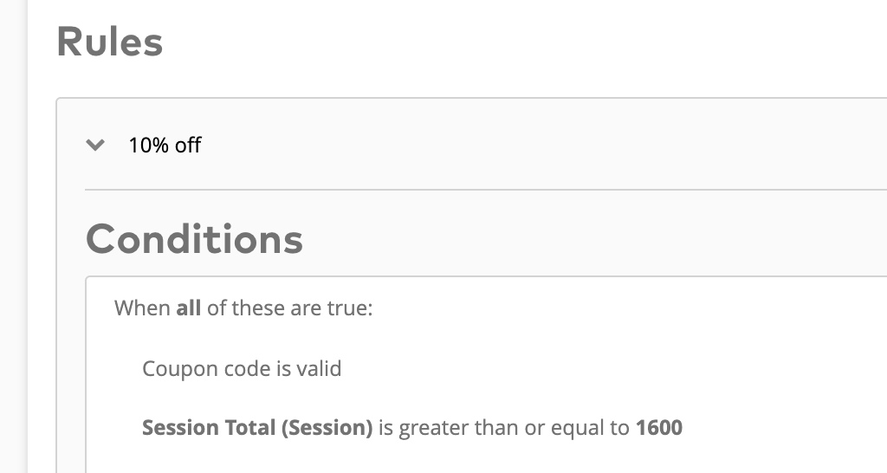
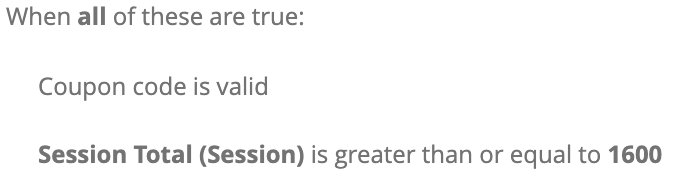

import { Head, Image, Notes, Appear } from '@mdx-deck/components'
import { Split, SplitRight, FullScreenCode } from '@mdx-deck/layouts'
export { default as theme } from './theme'


<Head>
  <title>
    Why we developed our own programming language: An introduction to TaLang
  </title>
</Head>


<Image src='images/1_slide.svg' />

---

<Image src='images/2_slide.svg' />

---

<Image src='images/3_slide.svg' />

---

## Demo Time

---

## Creating Promotions

<ul>
  <Appear>
    <li>
      Our customers create <b>Campaigns</b>
    </li>
    <li>
      These campaigns offer <b>Promotions</b>
    </li>
    <li>
      Promotions are defined by <b>Rules</b>
    </li>
    <li>
      Rules are built in the <b>Rule Builder</b>
    </li>
    <li>Rules are sent to the backend and stored in the database somehow</li>
  </Appear>
</ul>

---

## Evaluating promotions

<ul>
  <Appear>
    <li>End user adds item to cart, web shop calls Talon.One API</li>
    <li>
      Backend <b>reads rules from the database</b> somehow
    </li>
    <li>
      Backend needs to <i>somehow</i> <b>interpret</b> what it reads from the
      database
    </li>
    <li>Evaluate the rules, return effects if rules evaluate to true</li>
    <li>
      This is done in the <b>rule engine</b>
    </li>
  </Appear>
</ul>

---

### Requirements for efficient promotion rule management - pt 1

- Generate rules in the frontend
- Send them over API to the backend (JSON body)
- Store them in the database
- Read them at runtime and parse them in real time

---

### Requirements for efficient promotion rule management - pt 2

- Flexible enough to enable all types of conditions/effects
- Easily expandable, in case requirements change
- Stable, Predictable execution time

---

## In Comes Talang

---

## What is it?

<ul>
  <Appear>
    <li>Small lisp language</li>
    <li>Implemented completely in Golang</li>
    <li>Slim Core (~300 lines of code)</li>
    <li>
      Since version 2, open source 🎉{' '}
      <a href='https://github.com/talon-one/talang'>
        https://github.com/talon-one/talang
      </a>
    </li>
  </Appear>
</ul>

---

## Main Motivation

- Easy to parse
- Easy to represent as JSON
- Safe runtime properties
- Type-safe Expressions

---

### Types supported

- Primitives
  - `string`
  - `number`
  - `timestamp`
  - `boolean`
- "Complex"
  - `lists`
  - `records`

---

### Language Constructs

- Functions
- Blocks
- Templates (\*)

---

## Some Examples

<Notes>
  Mention the connection between Talang's expressions and actual
  conditions/rules
</Notes>

---

<Appear>
  <span>
    <pre>
      <code>(+ 12 34.5)</code>
    </pre>
  </span>
  <span>
    <pre>
      <code>=> 46.5 (number)</code>
    </pre>
  </span>
  <span>
    <pre>
      <code>(list "We" "Are" "Developers")</code>
    </pre>
  </span>
  <span>
    <pre>
      <code>=> ["We" "Are" "Developers"] (list sting)</code>
    </pre>
  </span>
</Appear>

---

<Appear>
  <span>
    <pre>
      <code>(join (list "We" "Are" "Developers") " ")</code>
    </pre>
  </span>
  <span>
    <pre>
      <code>=> "We Are Developers" (sting)</code>
    </pre>
  </span>
  <span>
    <pre>
      <code>(isEmpty (list))</code>
    </pre>
  </span>
  <span>
    <pre>
      <code>=> true (boolean)</code>
    </pre>
  </span>
</Appear>

---

## Let's drill down

---

### 1. Easy to parse

- Lisp is easy to parse
- Our lexer implementation consists of ~100 lines of code

<Notes>
  <ul>
    <li>we needed speed: parsing, interpreting, running</li>
    <li>
      Prefix (Polish) Notation + Shunting-yard algorithm Dijkstra, using
      abstract syntax tree
    </li>
    <li>
      not going deep here: in real-time we don't parse thanks to JSON structure
    </li>
  </ul>
</Notes>

---

### 2. Easy to represent as JSON

- LISP is by definition JSON-like

---

### 2. Easy to represent as JSON

```
(+ 12 34.5)

(join (list "We" "Are" "Developers") " ")
```

<Appear>
  <span>
    <pre>
      <code>['+', 12, 34.5]</code>
    </pre>
    <pre>
      <code>['join', ['list', 'we', 'are', 'developers'], ' ']</code>
    </pre>
  </span>
</Appear>

---

### 2. Easy to represent as JSON

- LISP is by definition JSON-like
- Persisted "as is" in the database
- Don't need to be parsed at runtime (!)
- Rule Builder can work with Javascript (well, Typescript) directly

---

### 3. Safe runtime properties

- No recursion
- No infinite loops

<Notes>We do not allow such flow controls</Notes>

---

### 4. Type-safe Expressions

- Using Golang's reflect package
- Types Mapping (Talang <=> Golang):
  - `Primitives` <=> `Primitives` (mapped accordingly)
  - `Lists` <=> `Arrays / Slices`
  - `Records` <=> `Structs`

<Notes>
  <ul>
    <li>unifying process</li>
    <li>functions arguments</li>
    <li>variadic supports</li>
  </ul>
</Notes>

---

All of this is cool, but how is it being used in practice?

🤔

<Notes>We can define stuff, what about the state/context?</Notes>

---

# Rule Builder

<Appear>
  <p>Where marketers define the campaign's rules</p>
</Appear>

<Notes>Our abstract construct for binding certain effects to conditions</Notes>

---



---

<Split>



```json
[
  What comes here ???
]

...
```

</Split>

---

<Split>


```json
[
  [
    '>=',
    ['.', 'Session', 'Total'],
    1600
  ]
]

...
```

</Split>

---

<Split>
  
  

```json
[
  ['isCouponValid'],
  [
    '>=',
    ['.', 'Session', 'Total'],
    1600
  ]
]

...
```

</Split>

---

<Split>
  
  

```json
[
  'and',
  ['isCouponValid'],
  [
    '>=',
    ['.', 'Session', 'Total'],
    1600
  ]
]

...
```

</Split>

---

## The Rule Builder:

- Holds visual representations of Talang expressions
- works directly with JSON Arrays
- From here -> persisted "as is" in the database

---

# Rule Engine

<Appear>
  <p>Where the magic happens ✨</p>
</Appear>

<Notes>
  <ul>
    <li>Each incoming requests gets an interpreter</li>
    <li>This is where the context is being set for the interpreter</li>
  </ul>
</Notes>

---

Rule Engine is

<p><b>State</b> (from the HTTP request)</p>

✚

<p><b>Rulesets</b> (from the database)</p>

👇

<p><b>Effects</b> (= Promotions)</p>

---

## Templates

- Our extension point for our customers
- Work like macros in LISP
- Can we used to
  - Simplify conditions / effects
  - Tackle specific use cases

---

<Image src='images/logo.svg' size='auto' height='25vh' />

Thank you very much for your attention!

Laurens: <a>vanwiele@talon.one</a>

Jakob: <a>shimony@talon.one</a>

<i>P.S. We are hiring!</i>

---

# Questions?
